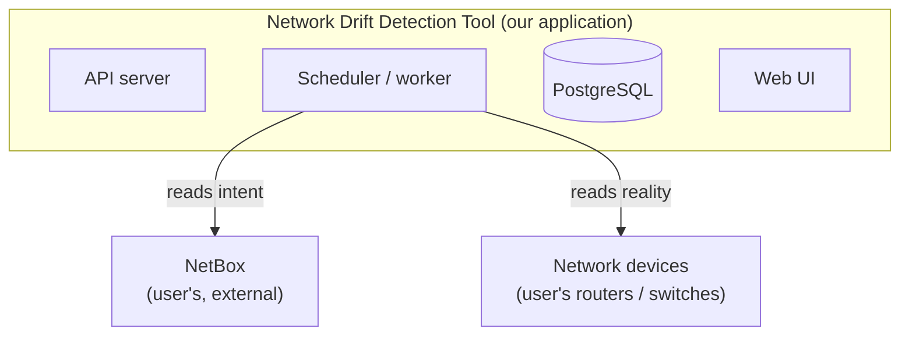

# Network Drift Detection Tool

Open-source network drift detection. Compares the *intended* state of a network
(documented in NetBox) against the *actual* live state of network devices, and
surfaces the differences ("drift").

The open-source alternative to NetBox Assurance.
**Status:** v0.2 — adds Postgres-backed drift history, a FastAPI service, a
React dashboard, an APScheduler that polls devices on a 1–5 minute interval,
Nokia SR Linux as a second vendor (alongside Arista cEOS), and `docker compose
up` to run the whole stack. See [`docs/PROJECT_PLAN.md`](docs/PROJECT_PLAN.md)
for the full roadmap.

## Architecture

One application that reads from two external systems it does not own — the
user's NetBox (intended state) and the user's network devices (actual state).



The five logical components: a **source-of-truth client** wrapping the NetBox
API, **collectors** for per-vendor device connections, a pure-function **diff
engine**, **storage + API** (Postgres + FastAPI), and a **web UI**. In v0.1 only
the NetBox client, the Arista collector, the diff engine, and the CLI exist.

## Quickstart

v0.1 runs against a local lab: Containerlab with two Arista cEOS nodes, plus a
local NetBox.

Prerequisites: Python 3.11+, Docker, Containerlab, a running NetBox, and the
Arista cEOS image imported.

```bash
# 1. Install the package (editable)
pip install -e .

# 2. Deploy the lab topology
cd lab
sudo containerlab deploy -t topology.yml
cd ..

# 3. Seed NetBox with the intended state (mirrors the lab topology)
export NETBOX_URL=http://localhost:8000
export NETBOX_TOKEN=<your-netbox-api-token>
python lab/seed_netbox.py

# 4. Configure device connection details
cp devices.example.yml devices.yml
#    then edit devices.yml with your lab node addresses and credentials

# 5. Run a drift check
driftcheck core-sw-01
```

If intent and reality match, `driftcheck` prints `OK — no drift`. Change a field
on the device (or in NetBox) and re-run to see a drift record.

## Frontend (development)

A React dashboard for viewing drift events lives in [`frontend/`](frontend/).
To run it locally:

```bash
cd frontend
npm install      # first time only
npm run dev      # starts Vite at http://localhost:5173
```

The dashboard fetches `/drifts` from the FastAPI service. In dev, Vite proxies
`/drifts` to `http://localhost:8000` (see [`frontend/vite.config.js`](frontend/vite.config.js)),
so the API must also be running:

```bash
uvicorn netdrift.api.app:app --reload
```

Frontend tests use Vitest:

```bash
cd frontend
npm test
```

For the full stack — Postgres, migrations, API, and scheduler — use Docker
Compose from the repo root: `docker compose up --build`. The dashboard then
talks to the containerized API.

## Documentation

The canonical project documents live in [`docs/`](docs/):

- [`PROJECT_PLAN.md`](docs/PROJECT_PLAN.md) — the full master plan and roadmap.
- [`schema.md`](docs/schema.md) — the normalized schema (the core data contract).

## License

Apache-2.0. See [`LICENSE`](LICENSE).