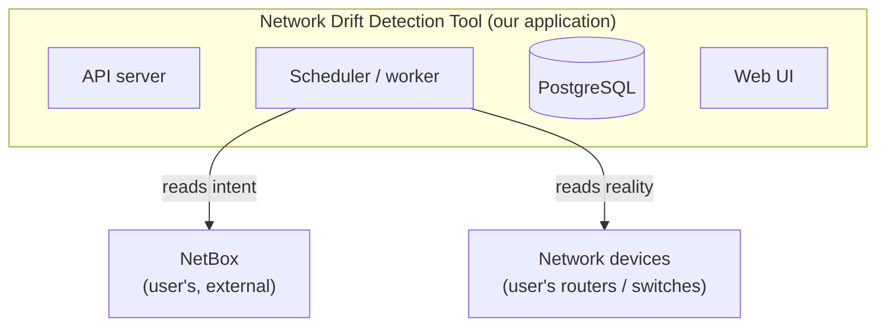

# Network Drift Detection Tool

Open-source network drift detection. Compares the *intended* state of a network
(documented in NetBox) against the *actual* live state of network devices, and
surfaces the differences ("drift").

The open-source alternative to NetBox Assurance.

**Status:** v3.0 — multi-vendor drift detection across Arista EOS, Cisco IOS-XE,
Nokia SR Linux, and Juniper Junos; interface, VLAN, routing (BGP/OSPF), and
running-config drift; optional auto-remediation that can push fixes back to
devices (**off by default**, gated, with a hard do-not-apply list); webhook
notifications; Postgres history; and a FastAPI + React dashboard. Intent can come
from NetBox or Nautobot. See [`docs/PROJECT_PLAN.md`](docs/PROJECT_PLAN.md) for the
roadmap and [`SECURITY.md`](SECURITY.md) before exposing the API.

## Architecture

One application that reads from two external systems it does not own — the
user's NetBox (intended state) and the user's network devices (actual state).


```mermaid
flowchart TD
    subgraph app["Network Drift Detection Tool (our application)"]
        api["API server"]
        worker["Scheduler / worker"]
        db[("PostgreSQL")]
        ui["Web UI"]
    end
    netbox["NetBox<br/>(user's, external)"]
    devices["Network devices<br/>(user's routers / switches)"]

    worker -->|reads intent| netbox
    worker -->|reads reality| devices
```

The five logical components: a **source-of-truth client** wrapping the NetBox
(or Nautobot) API, **collectors** for per-vendor device connections, a
pure-function **diff engine**, **storage + API** (Postgres + FastAPI), and a
**web UI**. As of v3.0 all five exist, with collectors and appliers for four
vendors and an opt-in remediation path.

## Quickstart

The development lab runs against Containerlab (two Arista cEOS nodes and a Nokia
SR Linux node), plus a local NetBox.

Prerequisites: Python 3.11+, Docker, Containerlab, a running NetBox, and the
Arista cEOS image imported.

```bash
# 1. Install the package (editable)
pip install -e .

# 2. Deploy the lab topology
cd lab
sudo containerlab deploy -t topology.yml
cd ..

# 3. Seed NetBox with the intended state (mirrors the lab topology)
export NETBOX_URL=http://localhost:8000
export NETBOX_TOKEN=<your-netbox-api-token>
python lab/seed_netbox.py

# 4. Configure device connection details
cp devices.example.yml devices.yml
#    then edit devices.yml with your lab node addresses and credentials

# 5. Run a drift check
driftcheck core-sw-01
```

If intent and reality match, `driftcheck` prints `OK — no drift`. Change a field
on the device (or in NetBox) and re-run to see a drift record.

## Remediation (opt-in)

Beyond detection, netdrift can push a fix back to a device to restore intent.
This is **off by default** and gated at three levels — a global switch, a
per-issue flag, and a per-device pause — with operational-symptom fields and
management interfaces on a hard do-not-apply list. Every fix can be dry-run
before it is applied.

The HTTP API that triggers applies ships **without authentication before v3.5**.
Do not expose it to an untrusted network; run it behind your own auth layer or
expose only the read-only deployment. See [`SECURITY.md`](SECURITY.md).

## Frontend (development)

A React dashboard for viewing drift events lives in [`frontend/`](frontend/).
To run it locally:

```bash
cd frontend
npm install      # first time only
npm run dev      # starts Vite at http://localhost:5173
```

The dashboard fetches `/drifts` from the FastAPI service. In dev, Vite proxies
`/drifts` to `http://localhost:8001` (see [`frontend/vite.config.js`](frontend/vite.config.js)),
so the API must also be running:

```bash
uvicorn netdrift.api.app:app --reload --port 8001
```

Frontend tests use Vitest:

```bash
cd frontend
npm test
```

For the full stack — Postgres, migrations, API, and scheduler — use Docker
Compose from the repo root: `docker compose up --build`. The dashboard then
talks to the containerized API.

## Documentation

Full documentation is published at the project's GitHub Pages site. The source
lives in [`docs/`](docs/):

- [`schema.md`](docs/schema.md) — the normalized schema (the core data contract).
- [`PROJECT_PLAN.md`](docs/PROJECT_PLAN.md) — the full master plan and roadmap.
- [`lab.md`](docs/lab.md) — lab environment setup.

## License

Apache-2.0. See [`LICENSE`](LICENSE).