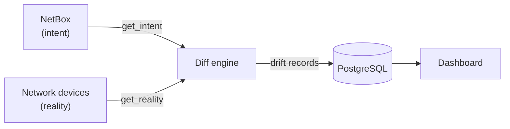

# Network Drift Detection Tool

**The open-source, self-hosted alternative to NetBox Assurance.**

Network Drift Detection continuously compares the *intended* state of your network — documented in NetBox — against the *actual* live state of your devices. When they diverge, you know immediately.

## Why this exists

NetBox is where your team documents what the network *should* look like. But it never checks reality. Devices get changed out-of-band, configs drift from intent, and nobody knows until something breaks.

This tool is the checker. It polls your devices on a schedule, diffs what it finds against NetBox, and surfaces every difference — "drift" — in a dashboard with timestamps and history.

## Features

- **Multi-vendor** — Arista EOS, Nokia SR Linux, and Cisco IOS-XE out of the box. Add new vendors via the plugin registry with no edits to core code.
- **Interface, VLAN, and routing drift** — descriptions, admin state, IP addresses, VLANs, BGP neighbors, and OSPF adjacencies.
- **Config-level drift** — compares the device's running config against a NetBox-rendered intended config.
- **React dashboard** — per-device drift history with severity levels (critical / warning / info).
- **Syslog trigger** — a device event triggers an immediate targeted poll rather than waiting for the next cycle.
- **One command to run** — `docker compose up` starts the full stack: Postgres, API, scheduler, and frontend.

## How it works



The five components:

| Component | What it does |
|---|---|
| **NetBox client** | Calls the NetBox API and returns intended state in the normalized schema |
| **Collectors** | Connect to live devices (one module per vendor) and return actual state in the same schema |
| **Diff engine** | Pure function — two schema dicts in, a list of drift records out |
| **Storage + API** | PostgreSQL for history; FastAPI serving drift records to the dashboard |
| **Dashboard** | React app displaying drift by device, field, and severity |

## Quick start

```bash
# Full stack — Postgres, API, scheduler, frontend
docker compose up --build
```

The dashboard is then available at `http://localhost:5173`. See [Getting Started](lab.md) to set up the lab environment first.

## Status

**v1.0** — config-level drift, plugin collector registry. See the [Roadmap](PROJECT_PLAN.md) for the full version history and what's planned next.
